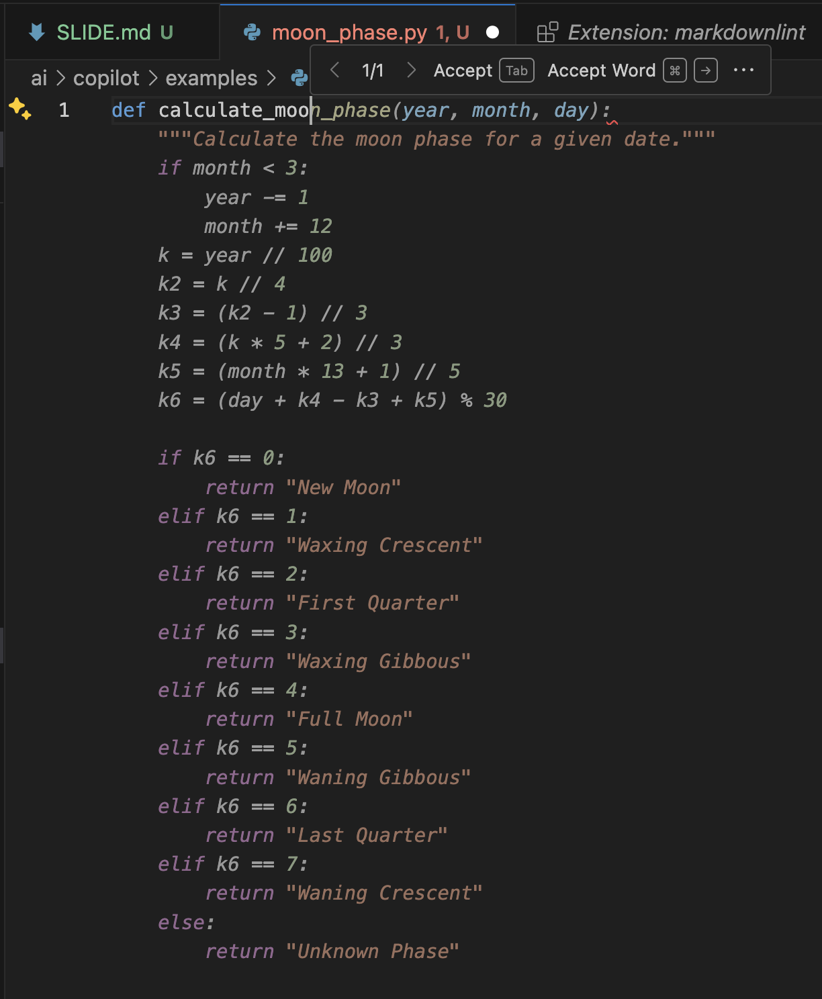
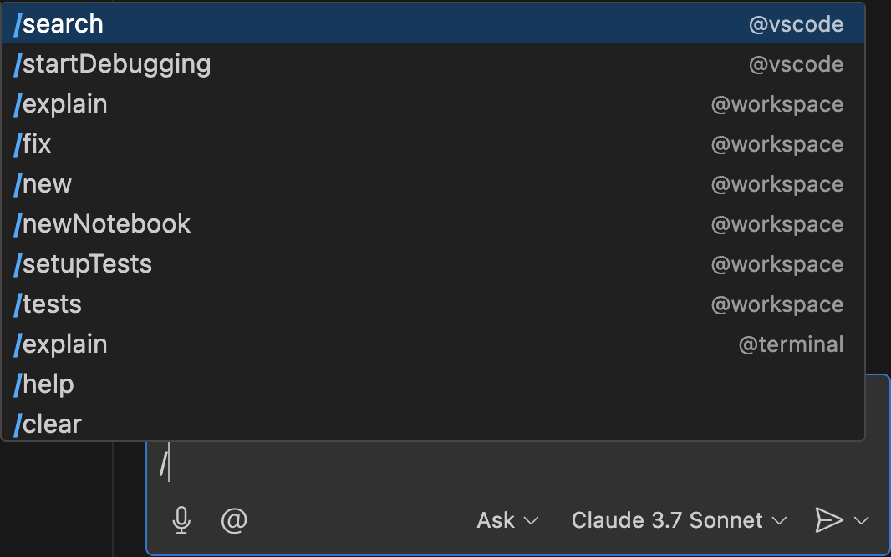

# COPILOT

---

## Corso LinkedIn Learning

<https://www.linkedin.com/learning/practical-github-copilot>

---

## Autocompletamento

La funzione più elementare di copilot da usare è l'autocompletamento.

L'autocompletamento è fortemente influenzato dal contesto

---

## Autocompletamento e contesto

- Nome file
- Nome funzione
- Commenti

Se molto specifici, forniscono contesto

---

## Autocompletamento - esempio

---

## Autocompletamento - pannello

(VS Code)

[CMD | CTRL] + [SHIFT] + P

"Open Completions Panel"

---

## Chat - comandi "slash" 

Si attivano con **/** (VS Code)

