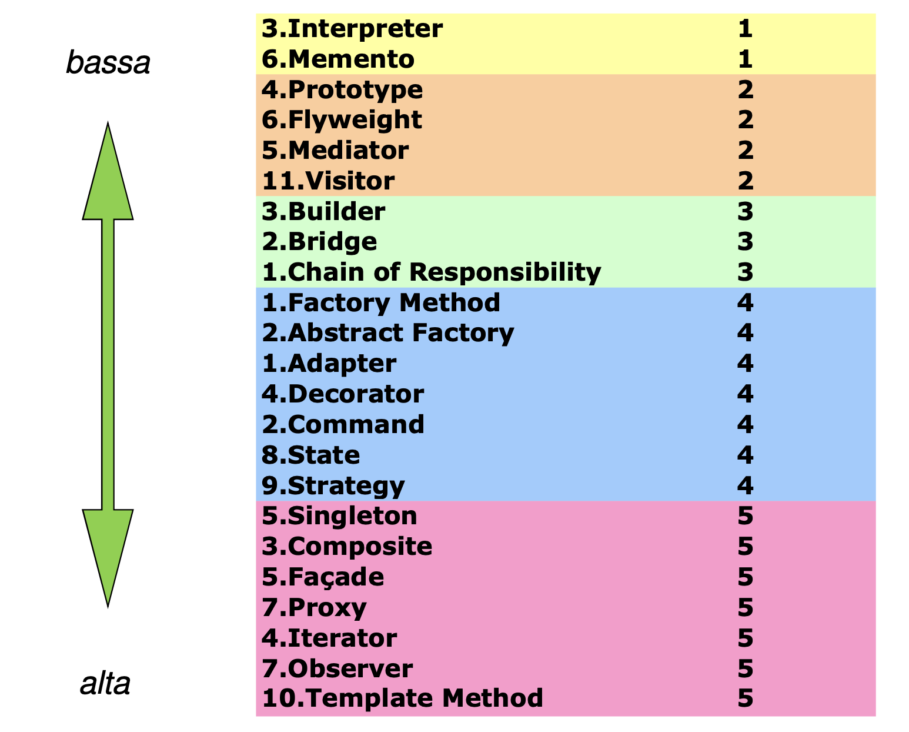

# DESIGN PATTERNS

---

## Corso ENG: DP

* Design patterns GoF
* Cenni ai design principles

---

## Presentazione: Oggi

Breve illustrazione della struttura del corso

* Cenni ai design principles
* Illustrazione di **un** dp esemplificativo (chain of responsibility)

---

## Presentazione: Next step

TBD per incontro/i successivo/i

* Lab interattivo su altri DP da scegliere in
  base a feedback e interesse
* Varie ed eventuali a richiesta

---

## Design principles

1. DRY (Don’t Repeat Yourself)
2. KISS (Keep it short and simple)
3. YAGNI (You ain’t gonna need it)
4. S.O.L.I.D. (acronimo per 5 principles)
  
---

## Design principles - SOLID

1. Single Responsibility
2. Open Closed Principle
3. Liskov
4. Interface Segregation
5. Dependency Inversion
  
---

## Design pattern - Introduzione / 1

* Soluzioni a problemi comuni e ricorrenti
* Frutto di esperienza e processo induttivo
* Standardizzazione
* Generalità / astrazione
* Primo anno citato di storia: 1977 (-> induzione + esperienza)

---

## Design pattern - Introduzione / 2

<style scoped>
p {
    font-style: italic;
}
</style>

Un pattern descrive il nucleo di una soluzione relativa,
un problema che compare frequentemente in un dato contesto

Christopher Alexander (architetto)

---

## Design pattern - Introduzione / 3

<style scoped>
p {
    font-style: italic;
}
</style>

Il modello della soluzione deve essere strutturato
in modo tale che “si possa usare tale soluzione un
milione di volte, senza mai farlo allo stesso modo”

Christopher Alexander (architetto)

---

## Macro categorie di pattern

Le principali categorie di pattern sw sono:

* Architetturali (es. client server, MVC)
* Progettuali ("via di mezzo", i "nostri")
* Idiomi (basso livello, legati al linguaggio, es. il Singleton)

---

## Classificazione dei pattern

<style scoped>
table {
    display: table;
    width: 100%;
    font-size: 24px;
}
th, td {
    text-align: center;
    padding: 0;
    margin:0
}

</style>

| Creazionali            | Strutturali           |Comportamentali         |
| ---                    | ---                   |---                     |
| _(costruttore)_        | _(attributi)_         |_(metodi)_              |
| Factory method         | Adapter               |Interpreter             |
| Abstract Factory       | Bridge                |Template Method         |
| Builder                | Composite             |Chain of Responsability |
| Prototype              | Decorator             |Command                 |
| Singleton              | Facade                |Iterator                |
|                        | Flyweigh              |Mediator                |
|                        | Proxy                 |Memento                 |
|                        |                       |Observer                |
|                        |                       |State                   |
|                        |                       |Strategy                |
|                        |                       |Visitor                 |

---

## Frequenza d'uso dei pattern

<style scoped>
img {
    display: block;
    margin: 0 auto;
}
</style>



---

## Leitmotiv

Nei pattern (creazionali in primis, ma tutti) si notano
due fondamentali linee guida:

* Chiamate polimorfiche di metodi
* Utilizzo degli oggetti attraverso le loro interfacce

---

<style scoped>
p {
    font-size: 48px;
    text-align: center;
}
</style>

## Pattern scelto

Chain of responsibility

---

## Chain Of responsibility / Schema

<style scoped>
img {
    display: block;
    margin: 0 auto;
}
</style>

E' un pattern comportamentale (_"behavioural"_)

Lo scopo del Chain of Responiibility è quello di
fornire un serie di handler di una stessa richiesta
in sequenza,non sapendo in anticipo quale evaderà la richiesta.


---

## Chain Of responsibility / Struttura

<style scoped>
img {
    display: block;
    margin: 0 auto;
}
</style>


---

## Chain Of responsibility / Esempio

Elevamento a potenza

* Per piccoli numeri e esponente intero, si procede per moltiplicazioni ripetute
* Per numeri intermedi si usa usa math.pow
* Per grandi numeri si effettua un arrotondamento intero con l'operatore ```**```

---

## Chain Of responsibility / Filosofia

L'utilizzo (la scelta) del chain of responsibility fa sì
che la scelta di gestire la richiesta oppure di
rimandarla allo step succesivo sta nello step stesso
(a differenza ad esempio dello strategy dove la
selezione della strategie è "esterna" rispetto agli
step stessi)
